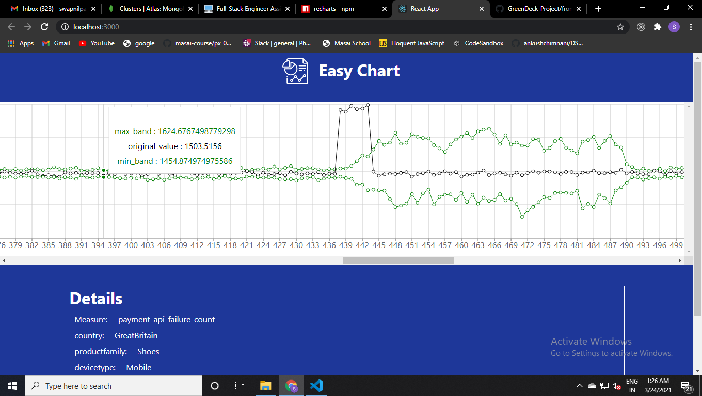

# GreenDeck-Project
## Git clone the repository
## Open the folder GreenDeck-Project &#8594; do 'npm install' 
## Now open frontend folder which is inside GreenDeck-folder &#8594; do 'npm install'
## Come back in the GreenDeck-Project folder &#8594; do 'npm run dev'

